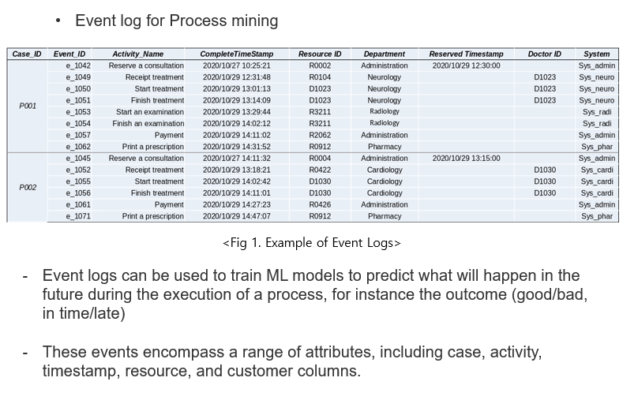

# Complexity Measures for Process Predictive Monitoring

**Writer:** Yeonsu Kim  
**Date:** 2023-08-28

# Introduction
This repository contains the code and resources for measuring the complexity of business process data used in process predictive monitoring. The project aims to provide tools and methods to evaluate the complexity of data, which can significantly impact the performance of predictive monitoring systems. 

Predictive Process Monitoring (PPM) aims at creating predictive models of aspects of interest of business process execution using historical data logged in event logs. Anticipating the expected performance of a PPM model can be crucial for model owners, for instance, to decide whether or not to embark on the model development in the first place. However, this is hard to do in practice. Each log is generated by a different business process and may or not contain attributes that effectively discriminate across the labels to be predicted. In this work, we investigate the extent to which the complexity measures developed in the machine learning (ML) literature for traditional classification problems can be used to anticipate the model performance in the specific PPM use case of outcome prediction. We found, as we could expect, a negative correlation between the encoded event log complexity and the model performance. This correlation is significant for a specific set of complexity measures when considering the model accuracy as a performance measure.

# Visuals
Below are some visual representations related to the complexity measures:




# Folders
```bash
📦Complexity_measures_for_PPM-1
┣ 📂Complexity
 ┃ ┣ 📜complexity_agg12.ipynb
 ┃ ┣ 📜complexity_agg15.ipynb
 ┃ ┣ 📜complexity_agg17.ipynb
 ┃ ┣ 📜complexity_excat12.ipynb
 ┃ ┣ 📜complexity_excat15.ipynb
 ┃ ┣ 📜complexity_excat17.ipynb
 ┃ ┣ 📜complexity_index12.ipynb
 ┃ ┣ 📜complexity_index15.ipynb
 ┃ ┗ 📜complexity_index17.ipynb
 ┣ 📂ML
 ┃ ┣ 📜acc_agg12.ipynb
 ┃ ┣ 📜acc_agg15.ipynb
 ┃ ┣ 📜acc_agg17.ipynb
 ┃ ┣ 📜acc_excat12.ipynb
 ┃ ┣ 📜acc_excat15.ipynb
 ┃ ┣ 📜acc_excat17.ipynb
 ┃ ┣ 📜acc_index12.ipynb
 ┃ ┣ 📜acc_index15.ipynb
 ┃ ┗ 📜acc_index17.ipynb
 ┣ 📜image copy 2.png
 ┣ 📜image copy 3.png
 ┣ 📜image copy 4.png
 ┣ 📜image copy.png
 ┣ 📜image.png
 ┗ 📜README.md
 ```

# References
[1] E. Alcobaça, F. Siqueira, A. Rivolli, L. P. Garcia, J. T. Oliva, and A. C. De Carvalho. MFE: Towards reproducible meta-feature extraction. The Journal of Machine Learning Research, 21(1):4503–4507, 2020.

[2] A. Augusto, J. Mendling, M. Vidgof, and B. Wurm. The connection between process complexity of event sequences and models discovered by process mining. Information Sciences, 598:196–215, 2022.

[3] C. O. Back, S. Debois, and T. Slaats. Entropy as a measure of log variability. Journal on Data Semantics, 8:129–156, 2019.

[4] V. H. Barella, L. P. Garcia, M. P. de Souto, A. C. Lorena, and A. de Carvalho. Data complexity measures for imbalanced classification tasks. In 2018 International Joint Conference on Neural Networks (IJCNN), pages 1–8. IEEE, 2018.

[5] F. J. Camacho-Urriolagoitia, Y. Villuendas-Rey, I. López-Yáñez, O. Camacho-Nieto, and C. Yáñez-Márquez. Correlation assessment of the performance of associative classifiers on credit datasets based on data complexity measures. Mathematics, 10(9):1460, 2022.

[6] C. Castiello, G. Castellano, and A. M. Fanelli. Meta-data: Characterization of input features for meta-learning. In Modeling Decisions for Artificial Intelligence: Second International Conference, MDAI 2005, Tsukuba, Japan, July 25-27, 2005. Proceedings 2, pages 457–468. Springer, 2005.

[7] M. Harl, S. Weinzierl, M. Stierle, and M. Matzner. Explainable predictive business process monitoring using gated graph neural networks. Journal of Decision Systems, 29(sup1):312–327, 2020.

[8] T. K. Ho and M. Basu. Complexity measures of supervised classification problems. IEEE transactions on pattern analysis and machine intelligence, 24(3):289–300, 2002.

[9] S. K. Karmaker, M. M. Hassan, M. J. Smith, L. Xu, C. Zhai, and K. Veeramachaneni. AutoML to date and beyond: Challenges and opportunities. ACM Computing Surveys (CSUR), 54(8):1–36, 2021.

[10] J. Komorniczak, P. Ksieniewicz, and M. Woźniak. Data complexity and classification accuracy correlation in oversampling algorithms. In Fourth International Workshop on Learning with Imbalanced Domains: Theory and Applications, pages 175–186. PMLR, 2022.

[11] A. C. Lorena, L. P. Garcia, J. Lehmann, M. C. Souto, and T. K. Ho. How complex is your classification problem? A survey on measuring classification complexity. ACM Computing Surveys (CSUR), 52(5):1–34, 2019.

[12] J. Luengo and F. Herrera. Domains of competence of fuzzy rule-based classification systems with data complexity measures: A case of study using a fuzzy hybrid genetic based machine learning method. Fuzzy Sets and Systems, 161(1):3–19, 2010.

[13] J. Luengo and F. Herrera. An automatic extraction method of the domains of competence for learning classifiers using data complexity measures. Knowledge and Information Systems, 42:147–180, 2015.

[14] L. Morán-Fernández, V. Bolón-Canedo, and A. Alonso-Betanzos. Can classification performance be predicted by complexity measures? A study using microarray data. Knowledge and Information Systems, 51:1067–1090, 2017.

[15] F. Z. Okwonu, B. L. Asaju, and F. I. Arunaye. Breakdown analysis of Pearson correlation coefficient and robust correlation methods. In IOP Conference Series: Materials Science and Engineering, volume 917, page 012065. IOP Publishing, 2020.

[16] A. Rivolli, L. P. Garcia, C. Soares, J. Vanschoren, and A. C. de Carvalho. Meta-features for meta-learning. Knowledge-Based Systems, 240:108101, 2022.

[17] C. Spearman. The proof and measurement of association between two things. International Journal of Epidemiology, 39(5):1137–1150, 2010.

[18] B. A. Tama, M. Comuzzi, and J. Ko. An empirical investigation of different classifiers, encoding, and ensemble schemes for next event prediction using business process event logs. ACM Transactions on Intelligent Systems and Technology (TIST), 11(6):1–34, 2020.

[19] I. Teinemaa, M. Dumas, M. L. Rosa, and F. M. Maggi. Outcome-oriented predictive process monitoring: Review and benchmark. ACM Transactions on Knowledge Discovery from Data (TKDD), 13(2):1–57, 2019.


 
